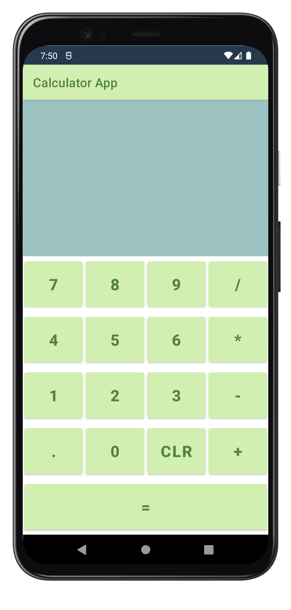
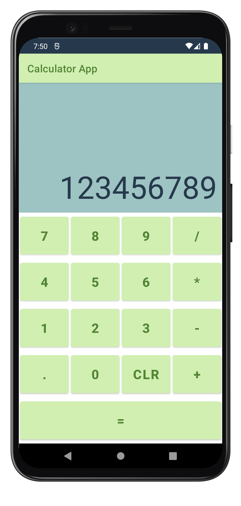
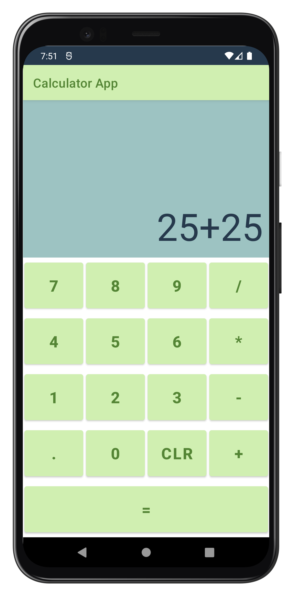
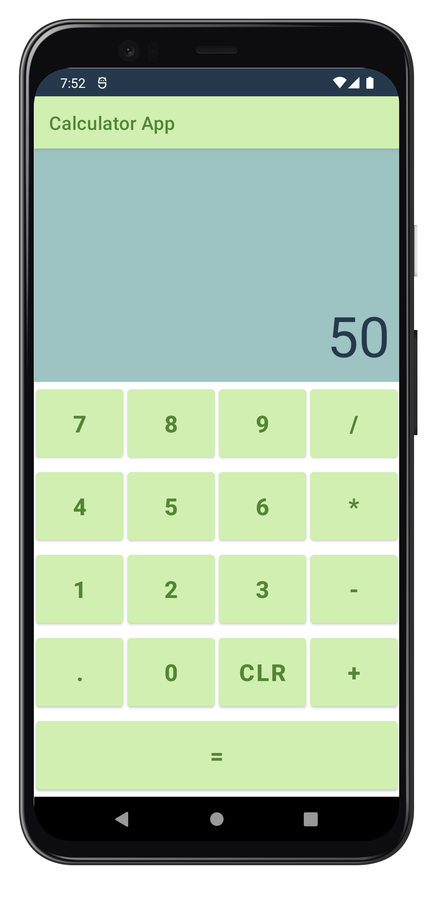
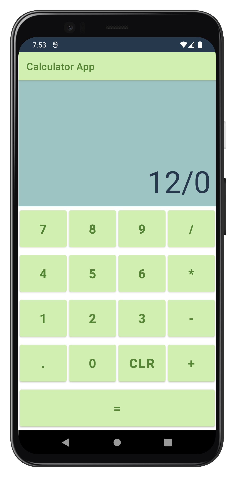
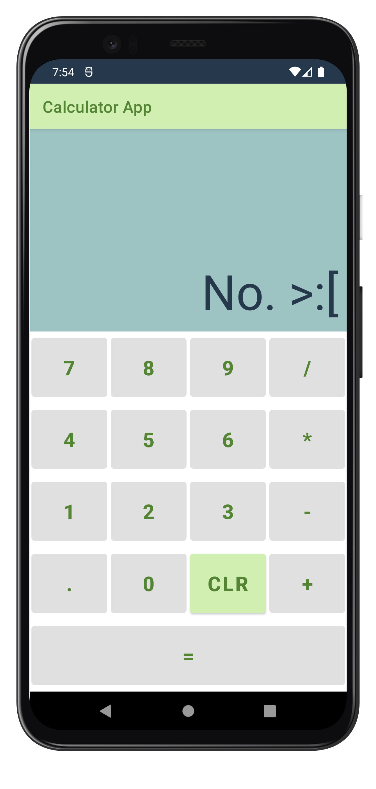

<h1 align="center">Calculorio</h1>
<h4 align="center">Simple Calculator App</h4>

## Description
A simple non-scientific calculator app showcasing proof of concept for operations logic. Refreshing cucumber themed color palette for an improved aesthetic.

Written in [Kotlin](https://kotlinlang.org/) using [MVC](https://medium.com/upday-devs/android-architecture-patterns-part-1-model-view-controller-3baecef5f2b6) architecture and uses the [Timber](https://github.com/JakeWharton/timber) logging library, the app has barebones functionality but the codebase is organized and clean.

## Improvements
* Expand to include scientific calculator functionality
* Implement more modern app icons
* Convert [XML](https://developer.android.com/develop/ui/views/layout/declaring-layout) to [Jetpack Compose](https://developer.android.com/jetpack/compose)
* Rewrite from [MVC](https://medium.com/upday-devs/android-architecture-patterns-part-1-model-view-controller-3baecef5f2b6) to [MVVM](https://www.digitalocean.com/community/tutorials/android-mvvm-design-pattern) architecture

## License
	Copyright 2023 Tyler OHearn
	
	Licensed under the Apache License, Version 2.0 (the "License");
	you may not use this file except in compliance with the License.
	You may obtain a copy of the License at
	
	   http://www.apache.org/licenses/LICENSE-2.0
	
	Unless required by applicable law or agreed to in writing, software
	distributed under the License is distributed on an "AS IS" BASIS,
	WITHOUT WARRANTIES OR CONDITIONS OF ANY KIND, either express or implied.
	See the License for the specific language governing permissions and
	limitations under the License.
